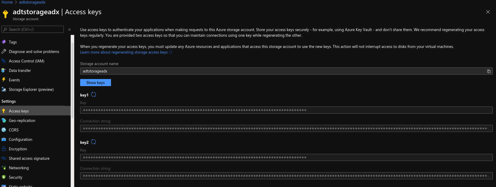

# Properties to overwrite :

Here is the list of properties that should be overwritten (in ```META-INF/microprofile-config.properties``` file):
- azure.storage.connection.string
- azure.storage.blob.container.name

If you want to overwrite these properties, you can write your own property values in the ```META-INF/microprofile-config.properties``` file, or set a property's system, or an environment variable named :
- AZURE_STORAGE_CONNECTION_STRING
- AZURE_STORAGE_BLOB_CONTAINER_NAME

## Where I can find the connection string?

- Connect to portal.azure.com
- Go under the desired section "Storage account"
- Go under the section "Access keys"
- Click on "show keys" and copy the value of the "connection string" into the desired config store :
  - System properties (AZURE_STORAGE_CONNECTION_STRING)
  - Environment variable (AZURE_STORAGE_CONNECTION_STRING)
  - microprofile-config.properties (azure.storage.connection.string)




## How-to

```
    <dependency>
      <groupId>com.github.Cosmo-Tech</groupId>
      <artifactId>azure-storage-connector</artifactId>
      <version>1.0-SNAPSHOT</version>
    </dependency>
```

## Tasks :

- [ ] Add more logs (maybe with some metrics)
- [ ] adapt generateFileTree in order to have relevant domain hierarchy
